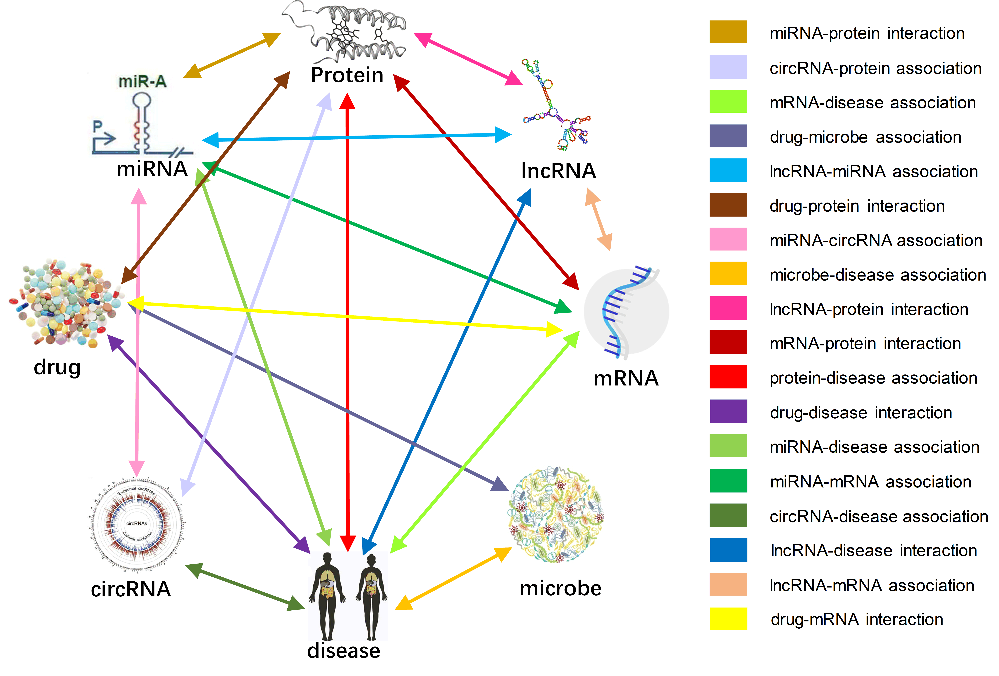

# Molecular Association Network (MAN) --Version 2.0 Update
#### A molecular association network that contains 8 kinds of molecules, 18 types of associations, 14,315 nodes, 114,150 molecular associations.  
  
The associations among miRNA, mRNA, circRNA, lncRNA, protein, drug, disease, and microbe, including miRNA-disease associations, circRNA-disease associations, circRNA-miRNA associations, disease-mRNA associations, disease-microbe associations, drug-disease interactions, drug-mRNA associations, drug-microbe associations, drug-protein interactions, lncRNA-disease associations, lncRNA-mRNA associations, lncRNA-miRNA associations, lncRNA-protein interactions, miRNA-drug associations, miRNA-mRNA associations, miRNA-protein interactions, mRNA-protein associations, protein-protein interactions. 
